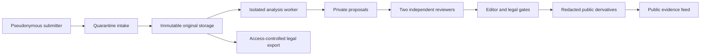

# Architecture

StudentVoice separates public publishing from sensitive evidence handling. `apps/web` is represented by the repository's `app/` directory, while `services/api` owns authorization and state transitions and `services/worker` performs local, rights-cleared media processing.

Machine output is never a publication. Proposals record model/version, confidence, timestamp, geometry, and derivative hash. Publications are immutable JSON snapshots; a correction creates a visible subsequent record.

Production uses separate Azure storage accounts or containers for quarantine, originals, public derivatives, and audit seals. Source contact data uses a separate encryption boundary. The API is the only component allowed to approve state transitions.
